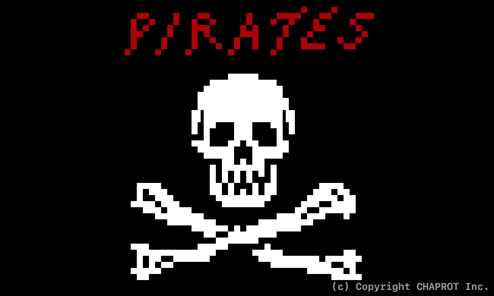
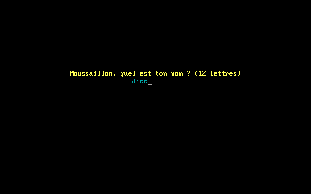
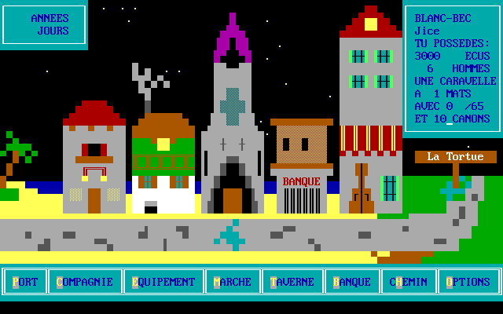
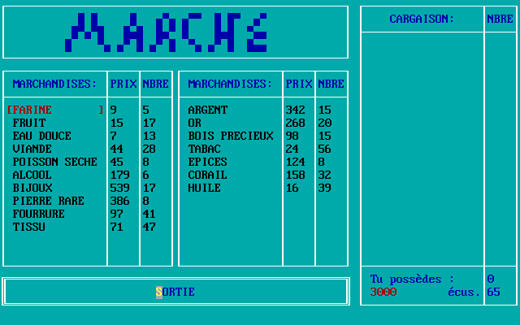
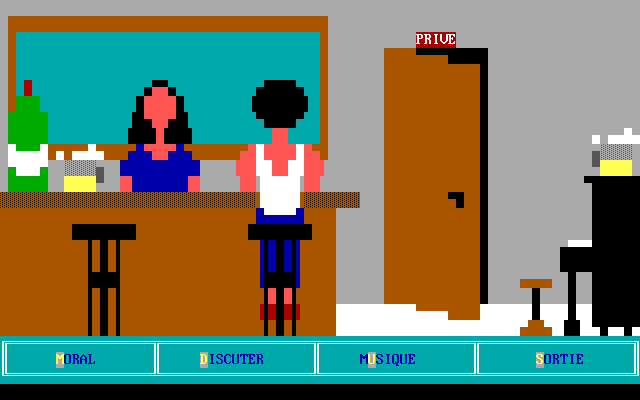
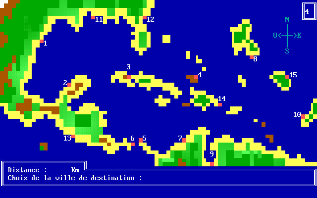
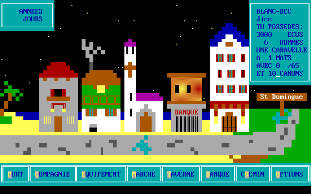
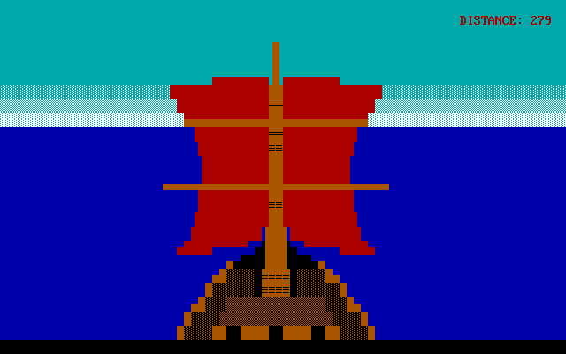
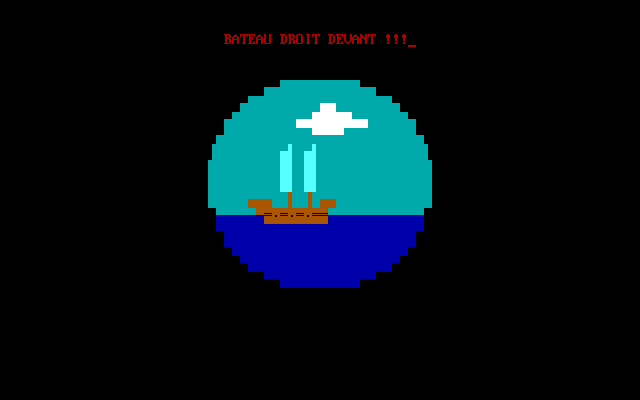
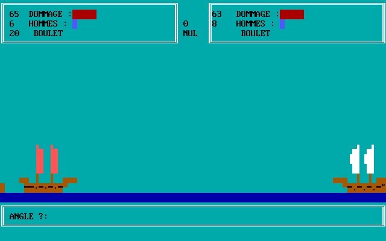

# Pirates

This is a port "as it" of __« Pirates »__, a game programmed with my buddies when we're 12 years old around 1990. Pirates have been developed on Turbo Pascal;
boy, we put a lot of love in it 😅!

> █&nbsp;&nbsp;&nbsp;&nbsp;█  
> █&nbsp;█  
> █&nbsp;&nbsp;oilà maintenant 20 ans que tu sillonnes les mers  
> et les océans. Après avoir vécu jusqu'à l'àge de 16 ans  
> comme petit mousse, à laver les ponts, à te faire insulter  
> par tes supérieurs, après avoir cotoyé les plus grands  
> flibustiers; ton rêve est maintenant de devenir leur égal.  
> Mais la route est encore longue : Tu n'es qu'un vulgaire  
> blanc-bec, et pour atteindre le stade suprême de Pirate,  
> il te faudra affronter les pires dangers.
> 
> &nbsp;&nbsp;Après quelques grosses difficultés, tu as enfin  
> réussi à réunir des amis et un maigre butin : tu possèdes 300 écus.  
>
> &nbsp;&nbsp;Tu es en ce moment amaré à l'Ile de la Tortue,  
> le fameux repère des plus grands Frères de la côte. Ton but  
> est de faire fructifier ton pactole. Pour cela, tu possèdes  
> une caravelle à 1 mât avec laquelle tu peux commercer de  
> ports en ports tout en recrutant des marins.  

Obviously, we didn't have Internet or smartphones, but we had time, lots of time...

I've converted the Pascal source to Rust, keeping the algorithm, naming, bugs etc...

## Build

You will need [Rust](https://www.rust-lang.org/tools/install).

```
$ cargo build --release
$ target/release/pirates
```

## Original Screenshots

Captured on DOSBox:



















